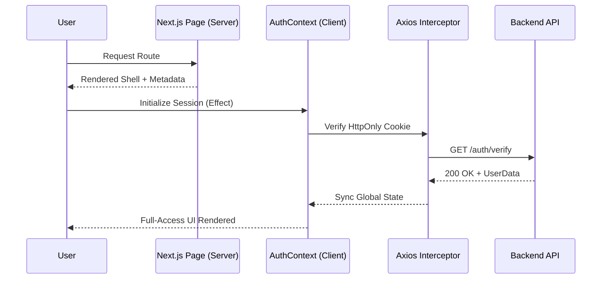

# CareerPulse - Strategic Excellence in Modern Career Platforms

[](https://nextjs.org/)
[](https://react.dev/)
[](https://tailwindcss.com/)
[](https://www.typescriptlang.org/)

CareerPulse is a high-performance, accessible Job Portal platform engineered with **Next.js 16/15** and **React 19**. This project showcases modern frontend architecture patterns, prioritizing speed, developer experience, and a premium user interface.

---

## 🏗️ Architectural Excellence

The frontend is built on the **Next.js App Router**, leveraging Server Components for performance and Client Components for rich interactivity.



---

## 🔥 Cutting-Edge Features

- **State-of-the-Art UX:** Utilizing **React 19** features and **Tailwind CSS 4** for lightning-fast styles and smooth micro-animations.
- **Smart Auth Lifecycle:** Integrated `AuthContext` with automatic session recovery, handling JWT handshakes via secure HttpOnly cookies.
- **Strategic Route Protection:** Implemented Layout-level guards for `(dashboard)` and `(auth)` route groups to ensure strict access control.
- **Global API Resilience:** Centralized Axios instance with interceptors for seamless token management, global error toast notifications, and request/response normalization.
- **Accessibility (A11y) First:** Built on top of **Radix UI** primitives to ensure the platform is inclusive and keyboard-navigable.

---

## 🎨 Design System

We use a curated design system that balances sleek aesthetics with high performance:
- **Foundations:** [Shadcn UI](https://ui.shadcn.com/) inspired component architecture.
- **Typography:** Optimized Google Fonts loading via `next/font`.
- **Icons:** [Lucide React](https://lucide.dev/) for a consistent, professional iconography set.
- **Responsiveness:** Mobile-first design with complex grid layouts for power-user dashboards.

---

## 🛠️ Tech Stack

- **Meta-Framework:** Next.js 16/15 (App Router)
- **Library:** React 19
- **Styling:** Tailwind CSS 4
- **Primitives:** Radix UI
- **Forms:** React Hook Form + Zod (Type-safe schemas)
- **Networking:** Axios with custom Interceptors
- **State Management:** React Context API

---

## 🚀 Development Setup

### Prerequisites
- Node.js 20+
- Backend API running (see [Backend README](../job-portal-backend/README.md))

### Environment Variables
Create a `.env.local` file:
```env
NEXT_PUBLIC_API_URL=http://localhost:3000/api
```

### Installation
```bash
# Install dependencies
npm install

# Run development server
npm run dev
```

Visit `http://localhost:3000` to see the application in action.

---

## 📝 Key Design Decisions

1.  **Server Components vs Client Components:** Maximized Server Components for data-heavy sections (Job Listings) to improve SEO and FCP, while isolating client state (Forms, Dashboard Interactivity) to Client Components.
2.  **Modular Component Strategy:** Highly reusable component library categorized into `ui`, `home`, `jobs`, and `auth` to ensure codebase maintainability as features scale.
3.  **Type Safety:** 100% TypeScript coverage ensuring that API responses and component props are strictly typed, reducing runtime regressions.

---

## 📝 License
This project is [UNLICENSED](LICENSE).
